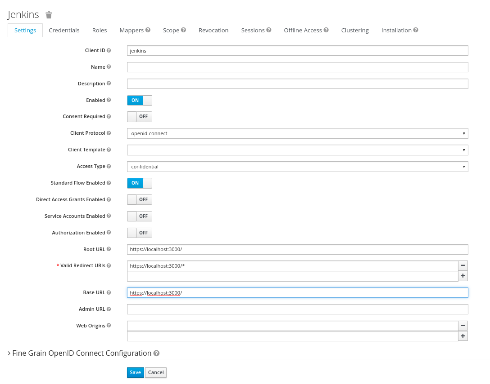
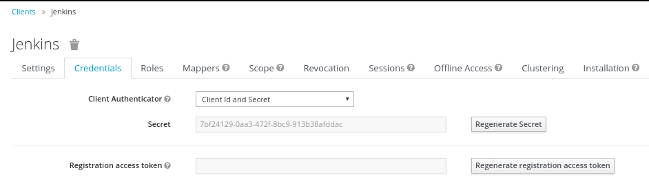
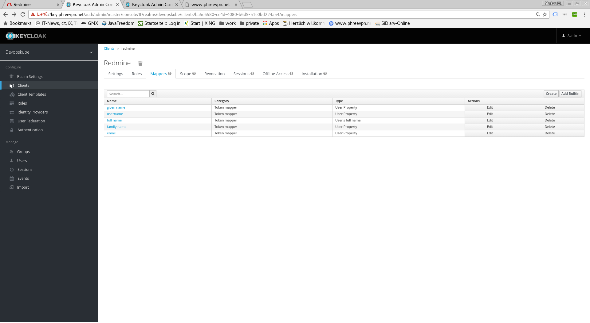

# Jenkins SSO

To provide SSO Services in our environemnt, we do use [Keycloak](http://www.keycloak.org/) as the central service. To use this in [Jenkins](http://www.jenkins.io/), we do use the [OpenId Connect Plugin](https://github.com/jenkinsci/oic-auth-plugin).

For this to work, a new client has to be created in the Keycloak System, and a couple of endpoints have to be configured in the Jenkins Security Settings.

## Keycloak Settings

All Settings done in the Keycloak Server are described in this section.

### Keycloak Client

The Keycloak client needs to get configured in the following way. The Client needs to have a unique name (in this case 'jenkins') and the 'Access Type' needs to get defined as 'confidential'. Please note especially the 'Valid Redirect URIs', which needs to get set to the URL of the Jenkins System (http://loccalhost:3000 in the screenshot).

### Keycloak Credentials

Because we have set the 'Access Type' to 'confidential' we do get offered the Credentials Tab. On this tab, we get a secret, which needs to get put into the corresponding Setting of the Jenkins OpenId Connect plugin. This secret allows to initiate a secure connection between the Keycloak System and your client application (Jenkins in this case).

### Keycloak Mappers

In order to provide some necessary user information to the Redmine System, the standard Keycloak Mappers have to be adopted and a new Mapper has to get created.

## Jenkins OpenId Connect Settings

The Settings done in the OpenId Connect Plugin Settings page are described in here.

The most relevant settings are the 'Client ID', the 'Client Secret' and the 'Urls'.

The 'Client ID' is the name of the client in your Keycloak System (jenkins in our case). By Specification, this should be a URI, but a plain name is working as well, and seems to be easier IMHO.

The 'Urls' have to be set to the Keycloak Server with the path /auth/realms/<REALMNAME>. Please adopt the REALMNAME (devopskube in the picture), to your own needs.

The 'Client Secret' is the secret found in the Keycloak Credentials page (see above), and should be copied from there.

## Hints

To retrieve the Keycloak Endpoints, you can use the Url https://KEYCLOAK_SERVER/auth/realms/<REALMNAME>/.well-known/openid-configuration.
