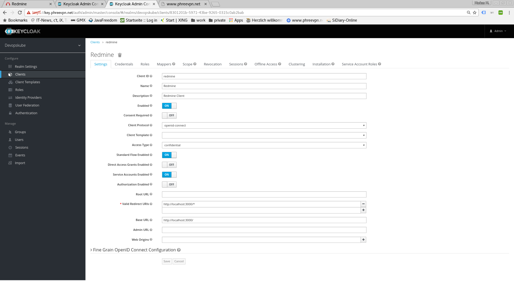
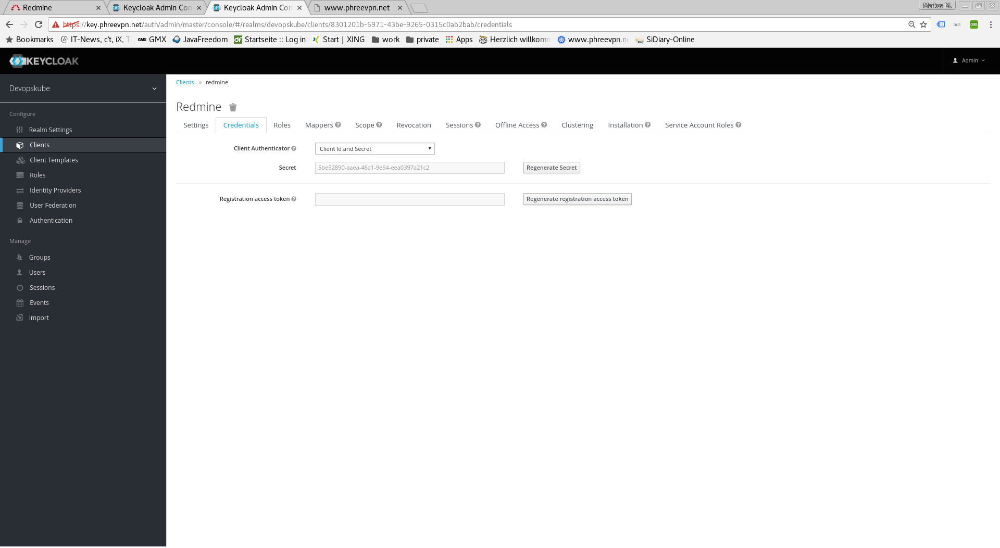
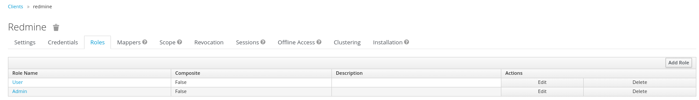
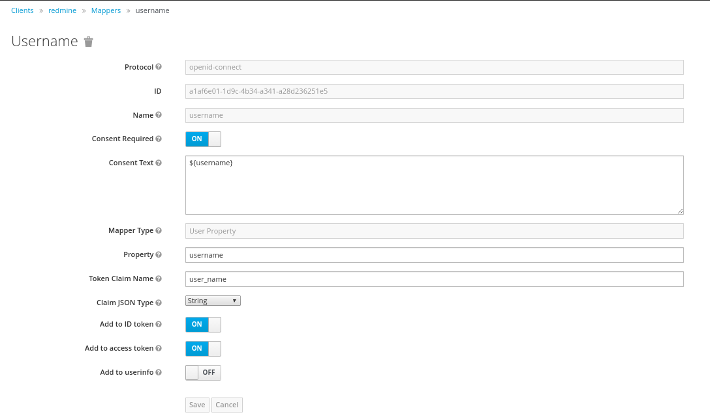
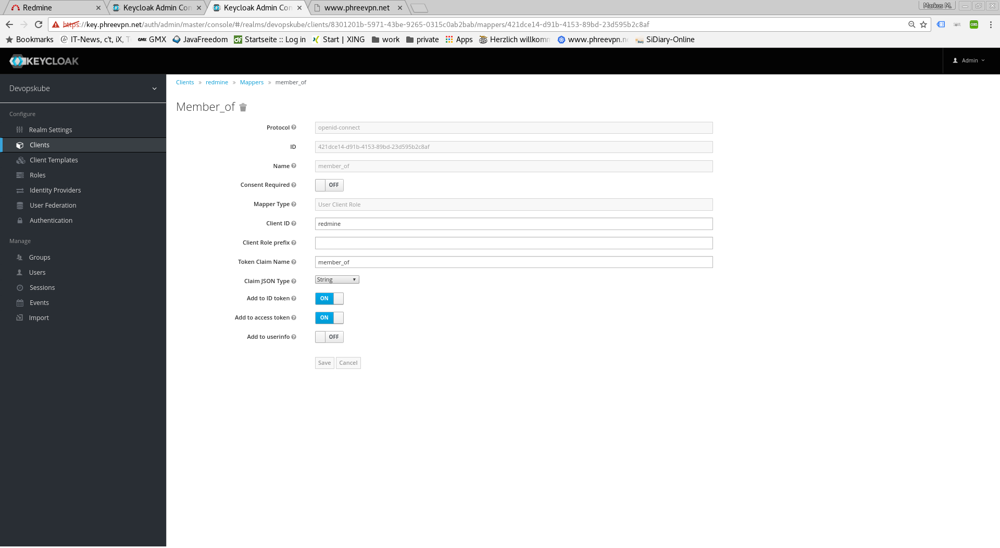
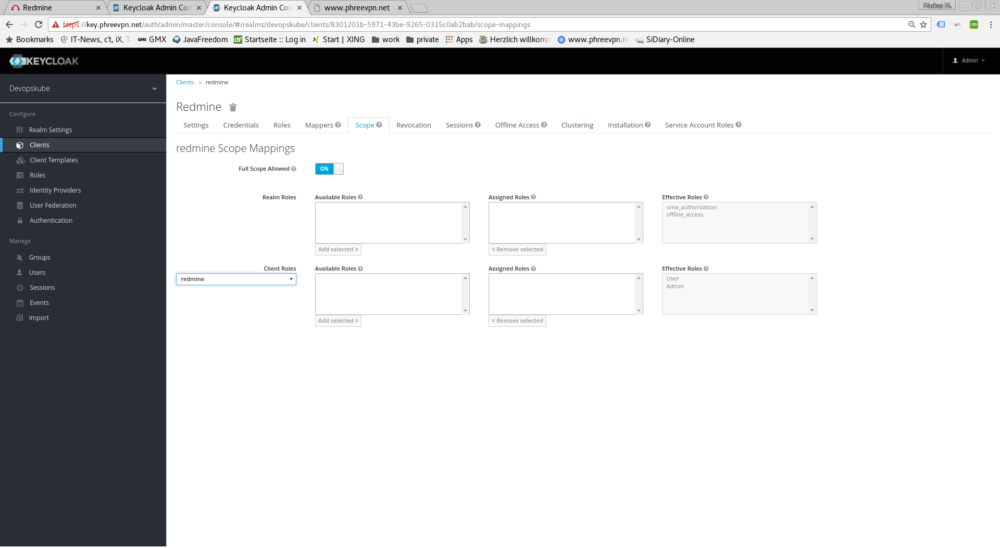
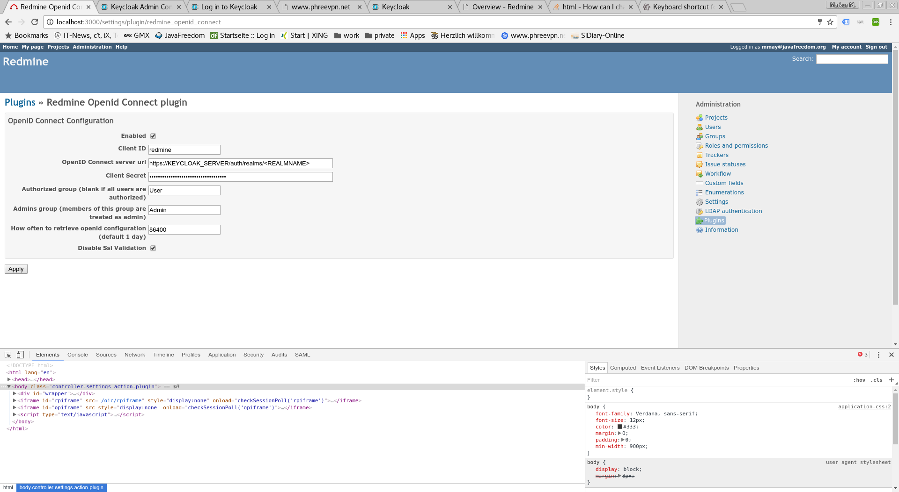

# Redmine SSO

To provide SSO Services in our environemnt, we do use [Keycloak](http://www.keycloak.org/) as the central service. To use this in [Redmine](http://www.redmine.org/), we do use a forked and adopted version of the [OpenId Connect Plugin](https://bitbucket.org/triplem74/redmine_openid_connect) (Note the two Pull-Requests to the original version of the plugin).

Some configuration changes in the Keycloak System are needed to make this work, these changes are documented in here. Furthermore some hints for the settings of the Redmine OpenId Connect Plugin are shown.  

## Keycloak Settings

All Settings done in the Keycloak Server are described in this section.

### Keycloak Client

The Keycloak client needs to get configured in the following way. The Client needs to have a unique name (in this case 'redmine') and the 'Access Type' needs to get defined as 'confidential'. Please note especially the 'Valid Redirect URIs', which needs to get set to the URL of the Redmine System (http://loccalhost:3000 in the screenshot).

### Keycloak Credentials

Because we have set the 'Access Type' to 'confidential' we do get offered the Credentials Tab. On this tab, we get a secret, which needs to get put into the corresponding Setting of the Redmine OpenId Connect plugin. This secret allows to initiate a secure connection between the Keycloak System and your client application (Redmine in this case).

### Keycloak Roles

The Redmine OpenId Connect plugin provides configuration options to be able to recognize a user as an admin, by using a specific Role and or just a normal User (by using another role and/or by providing no role in the configuration). To be able to use these possibilities, those roles ('User' and 'Admin') need to get configured in the Keycloak Client and later need to get assigned to the concrete user.

### Keycloak Mappers

In order to provide some necessary user information to the Redmine System, the standard Keycloak Mappers have to be adopted and a new Mapper has to get created.

The 'username' Mapper is usually mapped to the 'preferred_username' Token Claim Name. This needs to get adopted to 'user_name' in order that the Redmine OpenId Connect Plugin can use this information.

Furthermore the Role Mapper has to get created. This mapper (with the name 'mapper_of') has to be set to be of the Type 'User Client Role', and will contain the Client Role, the user is a member of.   

### Keycloak Scope

It is necessary to assign the wanted Client Roles to the Scope of the Client. This has to be done on the Scope-Tab. Both above created Roles ('User' and 'Admin') have to get assigned to the Scope.

## Redmine OpenId Connect Settings

The Settings done in the OpenId Connect Plugin Settings page are described in here.

The most relevant settings are the 'Client ID', the 'OpenID Connect server url' and the 'Client Secret'.

The 'Client ID' is the name of the client in your Keycloak System (redmine in our case). By Specification, this should be a URI, but a plain name is working as well, and seems to be easier IMHO.

The 'OpenID Connect server url' has to be set to the Keycloak Server with the path /auth/realms/<REALMNAME>. This is where you can access the dynamic Configuration Settings of Keycloak (https://KEYCLOAK_SERVER/auth/realms/<REALMNAME>). Obviously the KEYCLOAK_SERVER has to be exchanged with the name of the Server, where your Keycloak system is running, and the REALMNAME has to be replaced with the Keycloak Realm, your client is associated to.

The 'Client Secret' is the secret found in the Keycloak Credentials page (see above), and should be copied from there.

## Hints

In our forked version of the [Redmine OpenId Connect Plugin](https://bitbucket.org/triplem74/redmine_openid_connect) we added a setting, to be able to avoid the Validation of SSL Certificates ('Disable Ssl Validation'). This should just be used on Development Systems and not on Production Environments, therefore usage of this setting is on your own risk.

To be still able to login into Redmine during the testing and configuration phase (eg. your Keycloak is not working correctly or your settings in Redmine are not correct already), you can use the login URL with the parameter 'local_login', which allows you to login using the Redmine login form (eg. http://localhost:3000/login?local_login=true).

Via the Keycloak Url https://KEYCLOAK_SERVER/auth/realms/<REALMNAME>/.well-known/openid-configuration you can retrieve all endpoints available on the Keycloak server.
